# HALF User Manual (Page-Oriented)

[English](./user-manual.md) | [简体中文](./user-manual.zh-CN.md)

> **Version**: v0.2.x (current repository implementation)
>
> This document explains only what each page is for and how to operate it. It does not cover deployment/startup/environment variables (see `quickstart.md`).

---

## 1. How to Read This Manual

- This manual is organized by page and is suitable for end users or project coordinators to follow with screenshots.
- Each page section includes: **Purpose**, **How to Access**, **Steps**, and **Screenshot**.

---

## 2. Page Operation Guide

### 2.1 Login Page (`/login`)

**Purpose**

- Sign in to an account.
- Create a new account when registration is enabled.

**How to Access**

- Open the system entry URL; you will be taken to the login page.

**Steps**

1. Enter username and password, then click Sign In.
2. If a "Register" switch is shown (controlled by system configuration, for example `HALF_ALLOW_REGISTER=true`), switch to registration mode to create a regular account.

---

### 2.2 Project List Page (`/projects`)

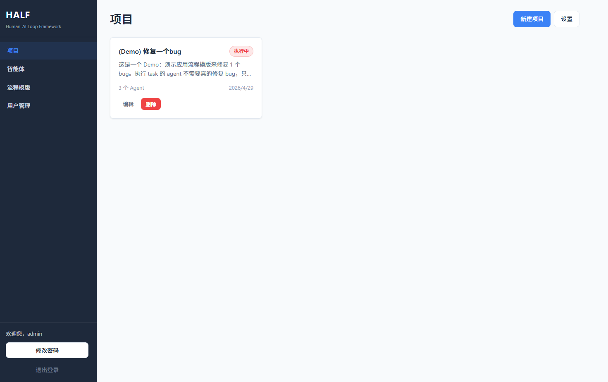

**Purpose**

- View all projects.
- Open project details.
- Create, edit, and delete projects.

**How to Access**

- Land here after login, or open "Projects" from the navigation bar.

**Steps**

1. Click "New Project" to open the creation page.
2. Click a project card title/description to open project details.
3. Click "Edit" to modify project information.
4. Click "Delete" to remove the project (related plans and tasks are removed as well).
5. All users can open "Notification Settings" to configure personal Feishu notifications; admins can also adjust global project parameters there.

---

### 2.3 Create Project Page (`/projects/new`)

**Purpose**

- Configure project basics.
- Select participating agents.
- Configure polling and timeout parameters.

**How to Access**

- From the project list, click "New Project".

**Steps**

1. Fill in project name and project goal.
2. Fill in the HALF collaboration repository URL and collaboration directory
   (leave the directory empty to use the default directory strategy). Keep the
   project code repository the same as the collaboration repository for
   single-repository workflows, or provide a separate project code repository
   when code changes should be committed elsewhere. For private repositories,
   complete GitHub access setup first (SSH key or token) by following
   `quickstart.md`.
3. Set polling parameters (polling interval, startup delay, task timeout).
4. Select at least one available agent.
5. Optionally mark selected agents as "same server".
6. Click "Create Project" to submit.

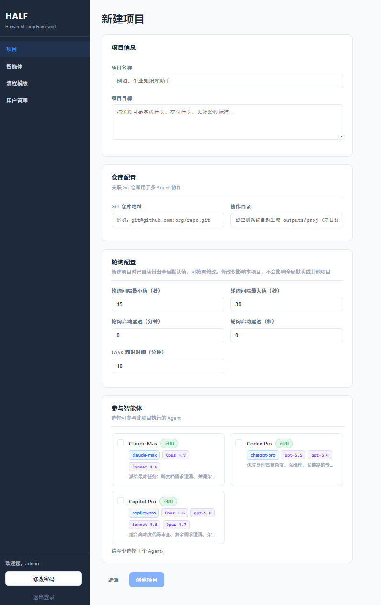

---

### 2.4 Edit Project Page (`/projects/:id/edit`)

**Purpose**

- Update existing project configuration and parameters.

**How to Access**

- From the project list, click "Edit" on the target project.

**Steps**

1. On the edit page, update project name, project goal, HALF collaboration
   repository URL, project code repository URL, and collaboration directory as
   needed.
2. Adjust polling parameters and agent assignment settings as needed.
3. Click "Update Project" to submit changes.

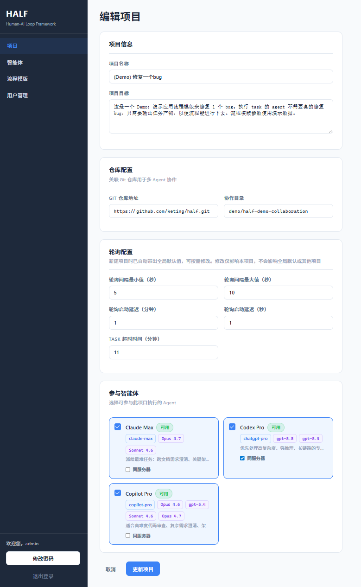

---

### 2.5 Project Detail Page (`/projects/:id`)

**Purpose**

- View single-project execution status at a glance.
- Quickly navigate to Plan, Tasks, and Summary pages.

**How to Access**

- From the project list, click the target project.

**Steps**

1. Review project basics (status, repository, collaboration directory, project goal).
2. Review execution snapshot (total, pending, running, completed, needs attention).
3. Review task queues (ready/running/blocked/needs attention).
4. Click "Refresh" to sync latest status.
5. Use page shortcuts to jump to Plan, Tasks, and Summary.

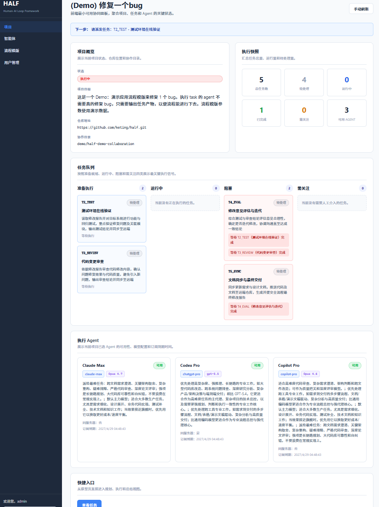

---

### 2.6 Plan Page (`/projects/:id/plan`)

**Purpose**

- Generate and finalize a task DAG (dependency graph).
- Supports two paths: "Generate from Template" and "Generate from Prompt".

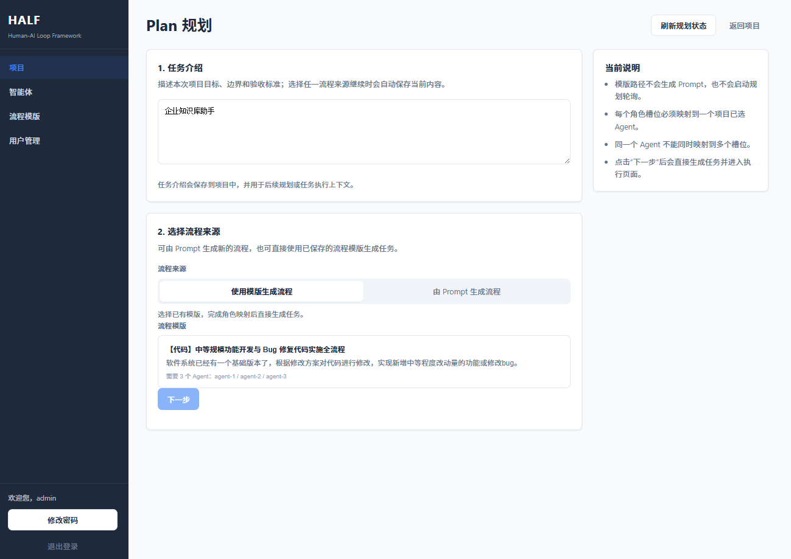

**How to Access**

- Open "Plan" from the project detail page.

**Steps (Template Path)**

1. Select "Generate from Template".
2. Select a template and map role slots (`agent-N` -> project agent).
3. Fill in `required_inputs`.
4. Click "Next" to generate tasks and enter execution.

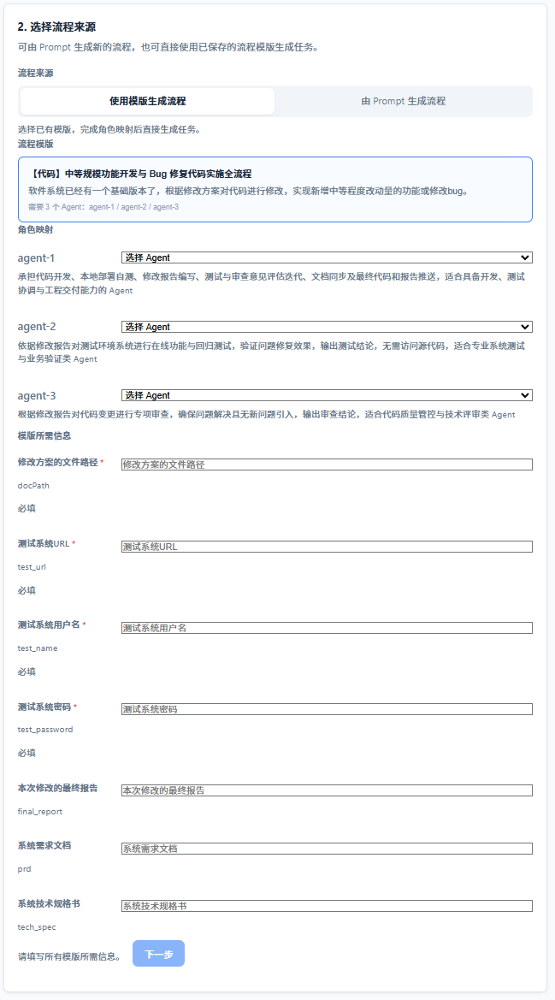

**Steps (Prompt Path)**

1. Select "Generate from Prompt".
2. Choose planning mode (`balanced / quality / cost_effective / speed`).
3. Select planning agents and optionally specify models.
4. Click "Generate Prompt".
5. Click "Copy Prompt", then send the copied content to an external planning agent.
6. After a valid `plan-<id>.json` is detected, the system finalizes automatically and navigates to the tasks page.

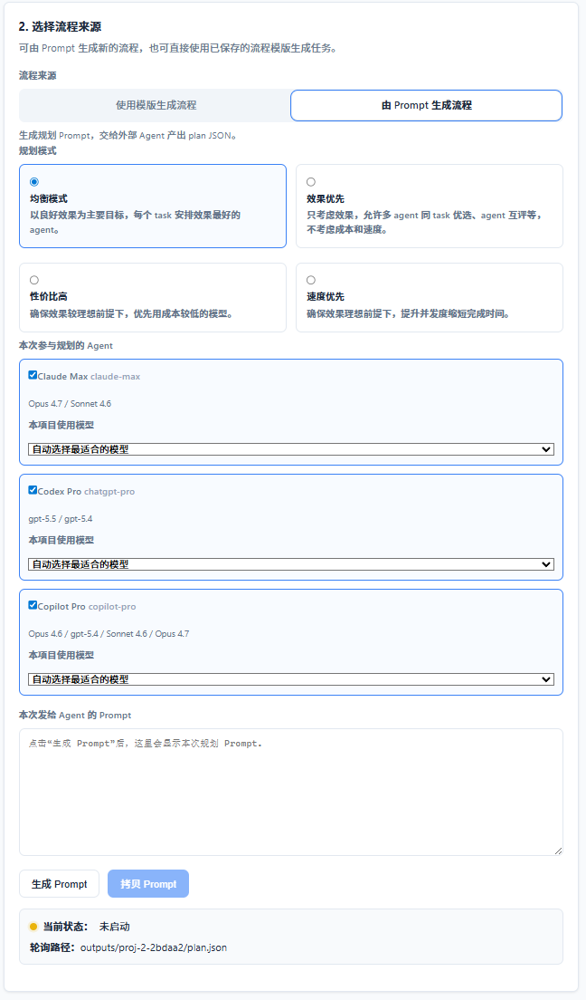

---

### 2.7 Plan Adjustment and Execution Page (`/projects/:id/tasks`)

**Purpose**

- Dispatch tasks according to DAG dependencies.
- Handle task exceptions during execution (redispatch/manual completion/abandon).

**How to Access**

- Enter from project details, or after plan generation is completed.

**Steps**

1. Select a task node in the left DAG; review details on the right panel.
2. For unlocked `pending` tasks, click "Copy Prompt and Dispatch".
3. For `running` or `needs_attention` tasks, use "Redispatch" or "Mark Complete Manually".
4. For unfinished tasks you no longer continue, use "Abandon Task".
5. Click "Refresh" to sync status.

**Key Rules**

- Successor tasks cannot be dispatched until predecessors are completed (or abandoned).
- If prompt copy fails, dispatch is aborted to avoid mismatch between feedback and actual copied content.

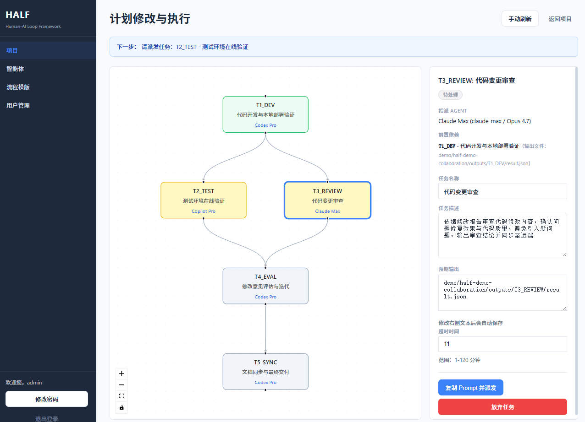

---

### 2.8 Execution Summary Page (`/projects/:id/summary`)

**Purpose**

- Review delivery outcomes and manual intervention records.

**How to Access**

- Open "Summary" from the project detail page.

**Steps**

1. Review task result table (task code, status, agent, output file, completion time).
2. Click output file paths to copy.
3. Review manual intervention records (`manual_complete`, `redispatched`, `abandoned`).

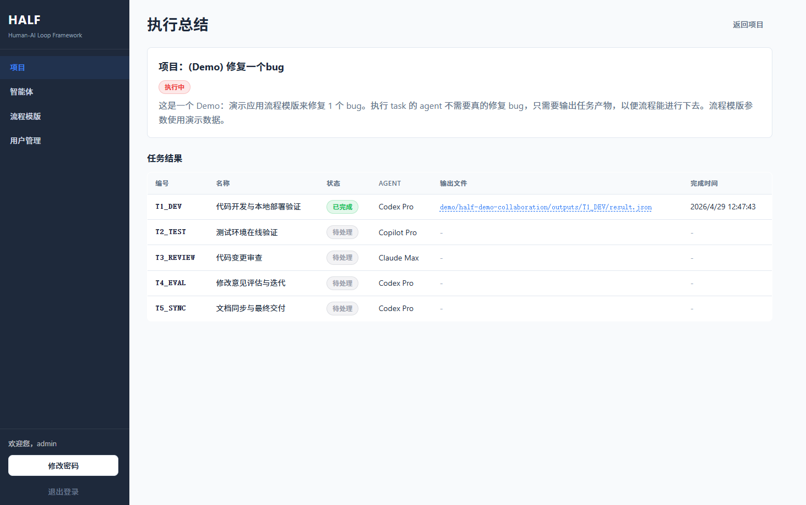

---

### 2.9 Agents Page (`/agents`)

**Purpose**

- Manage agents that can participate in projects.

**How to Access**

- Open "Agents" from the navigation bar.

**Steps**

1. Add agents (name, type, model, subscription expiry, reset strategy, etc.).
2. Edit or delete existing agents.
3. Reorder cards by drag-and-drop or "Auto Sort".
4. Switch availability via status badges.
5. For `chatgpt-pro` agents, log in with OpenAI OAuth and refresh Codex quota from the agent card.

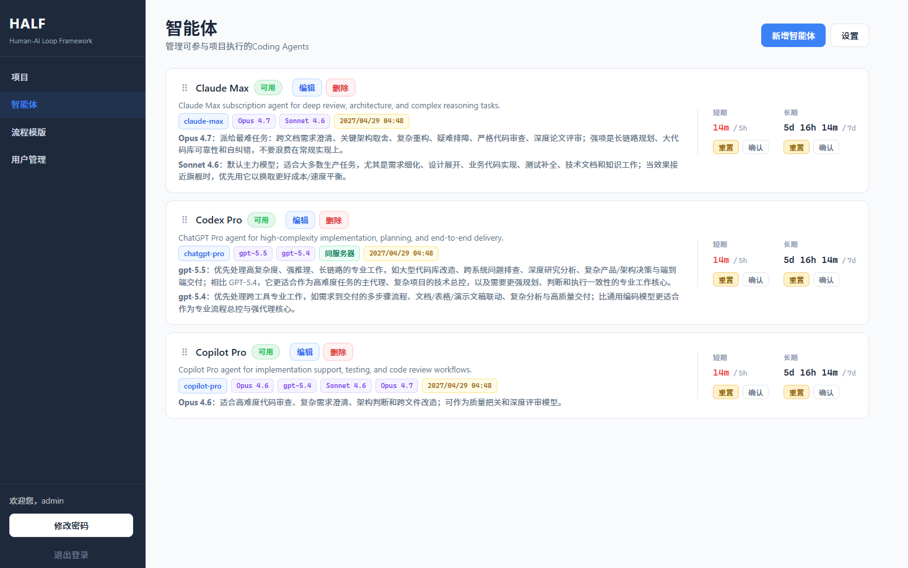

---

### 2.10 Process Templates Page (`/templates`, `/templates/new`, `/templates/:templateId`, `/templates/:templateId/edit`)

**Purpose**

- Build and reuse standardized process templates.

**How to Access**

- Open "Templates" from the navigation bar.

**Steps**

1. View templates on the list page and open details.
2. When creating/editing templates, maintain basic info, template JSON, role descriptions, and `required_inputs`.
3. Save templates and reuse them directly on the Plan page.

**Permissions**

- All logged-in users can view and use templates.
- Template creators and admins can edit/delete templates.

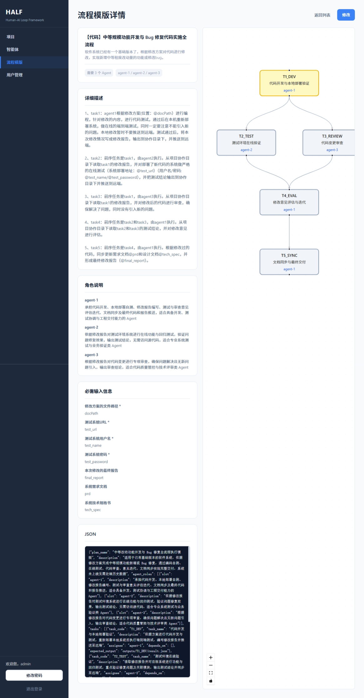

---

### 2.11 Settings Page (`/settings`)

**Purpose**

- **All logged-in users**: Configure personal Feishu Webhook notifications.
- **Admins additionally**: Adjust global project polling parameters and planning prompt settings.

**How to Access**

- All users can open "Notification Settings" from the top-right of the project list page; the entry label shows "Settings" for admins.

**Steps (Feishu Notifications)**

1. Enter your personal bot Webhook URL in the "Feishu Notifications" section.
   - URL format: `https://open.feishu.cn/open-apis/bot/v2/hook/<token>`
   - Leave blank to disable notifications for your account.
2. Select the event types you want to receive:
   - **Task Completed** (`completed`): triggered when polling detects a task is done.
   - **Task Timeout** (`timeout`): triggered when a task exceeds its configured time limit.
   - **Project Completed** (`project_completed`): triggered when all tasks in a project are done.
3. Click "Save Settings".

**Steps (Global Parameters — Admins Only)**

1. Configure global polling interval range, startup delay, and default task timeout.
2. Configure same-machine assignment guidance text for planning prompts.
3. Click "Save Settings".

**Notes**

- Feishu notifications are **per-account**: each user only receives notifications for projects and tasks they created.
- Push failures (network errors or invalid Webhook) are logged as warnings and **do not interrupt background polling**.
- Global polling parameters are defaults; project values are snapshotted at creation and not retroactively affected by later changes.

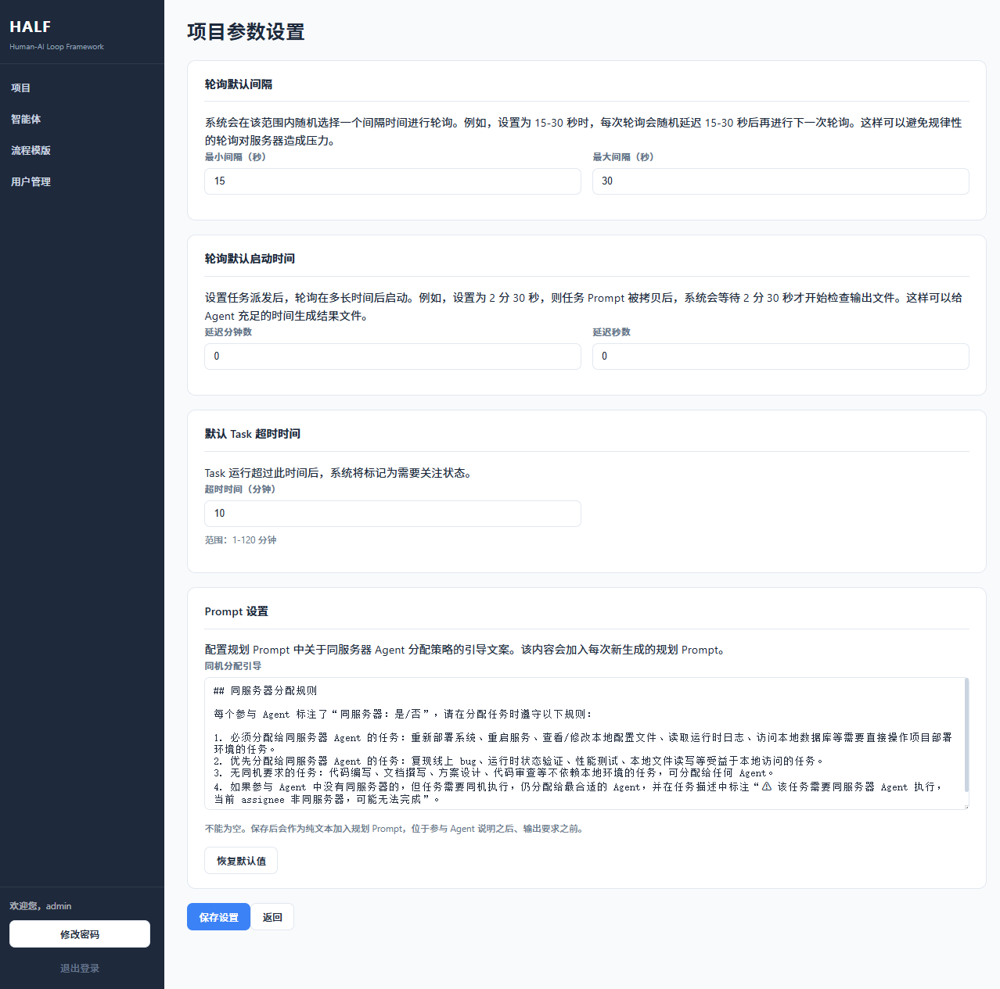

---

### 2.12 Agent Settings Page (Admin, `/agents/settings`)

**Purpose**

- Maintain system-level agent types and model catalog.

**How to Access**

- Admins can open "Agent Settings" from navigation or settings entry.

**Steps**

1. Add, edit, and delete agent types.
2. Add, edit, and delete models under each type (name, alias, capability description).
3. Drag to reorder types and models.

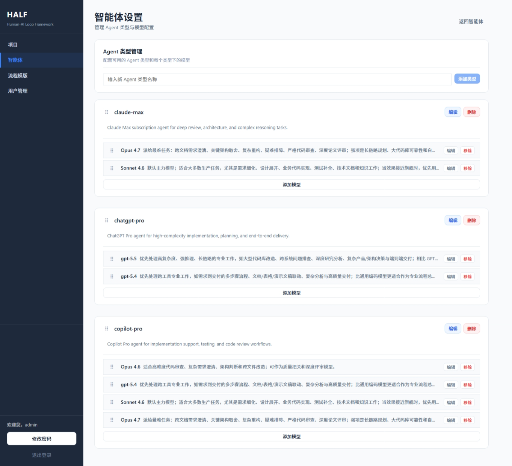

---

### 2.13 User Management Page (Admin, `/admin/users`)

**Purpose**

- Manage user roles and account status.

**How to Access**

- Admins can open "User Management" from navigation or backend entry.

**Steps**

1. View user list (created time, latest login, role, status).
2. Change user roles (admin/regular user).
3. Freeze or unfreeze accounts.

**Limits**

- You cannot freeze your own account.
- You cannot demote or freeze the last active admin.

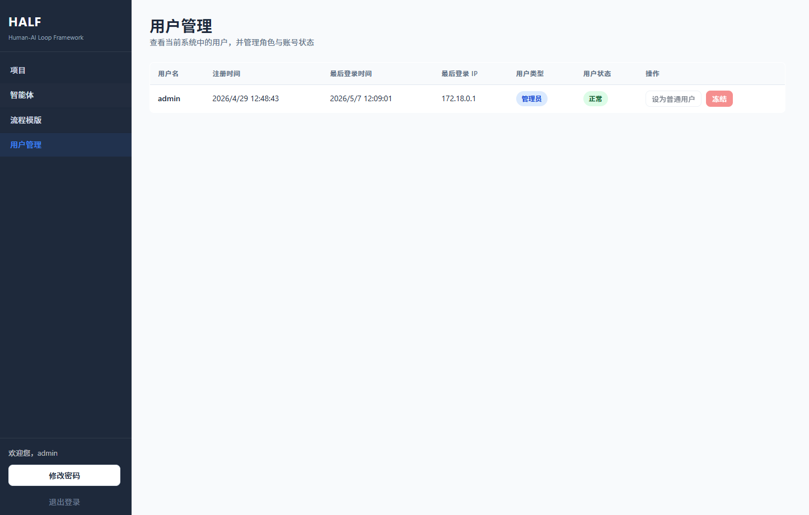

---

## 3. Minimum Closed Loop: Git Writeback and Completion

To move a task from "running" to "completed", the agent should follow this minimum closed loop:

1. Write task artifacts into: `<collaboration_dir>/<task_code>/`
2. After all artifacts are ready, write (and commit) `<collaboration_dir>/<task_code>/result.json` as the completion sentinel
3. Run `git add`, `git commit`, and `git push`
4. After HALF polling detects `result.json`, task status moves to completed and the result is visible on the Summary page

Note: `result.json` is the completion signal file and should be written and committed last.
